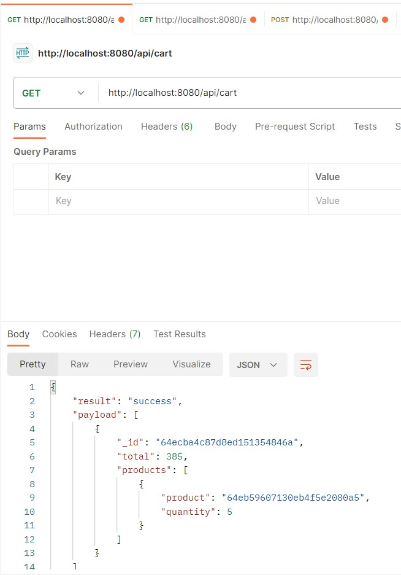
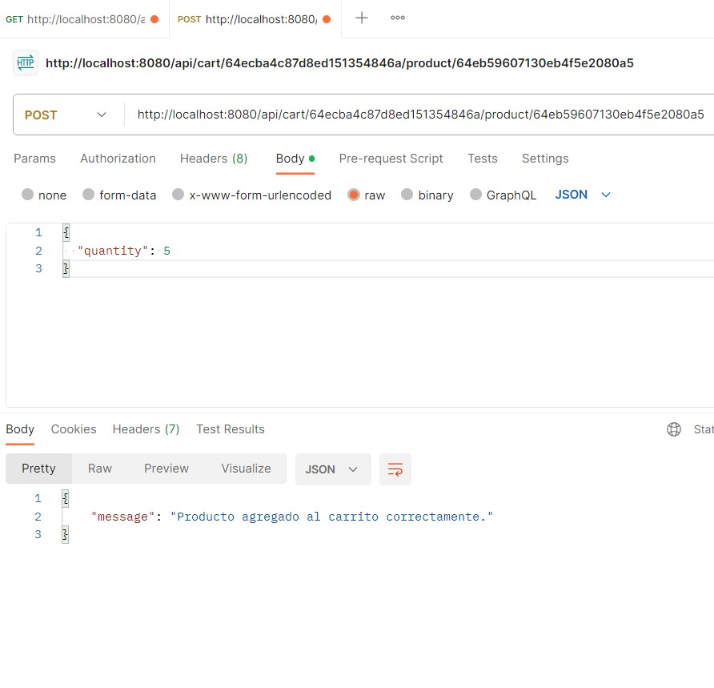

http://localhost:8080/
es donde gestiono el ingreso de productos con ingreso de imagen/optativa usando multer. Se puede eliminar 1 producto con su id que genera MongoDb 
Quedan guardados en BD.

En el carrito si le agrego un producto este se descuenta stock del producto y tiene el valor total de los productos, y si lo elimino los productos que estaban en el carrito vuelven al stock del producto que este tenia. El carrito se guarda en BD

http://localhost:8080/realtimeproducts
puedo ver los productos generados online con socket

http://localhost:8080/chat
si entran varios usuarios pueden chatear

Ejemplos de JSON que use en postman

Producto POST
http://localhost:8080/api/products

{
    "title": "ProductoG",
    "description": "productoGDescrip",
    "code": 25,
    "price": 77 ,
    "stock": 77,
    "category": "gaseosa"
}

Cart POST
http://localhost:8080/api/cart

{}

Producto en carrito
http://localhost:8080/api/cart/64ecba4c87d8ed151354846a/product/64eb59607130eb4f5e2080a5
{
  "quantity": 5
}

