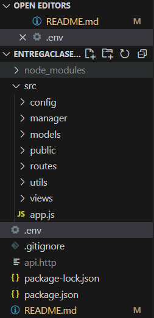
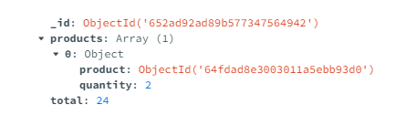

CRUD del "admin" completo

Vista del "user" para agregar carritos con su nombre de logueo

Archivo .env que luego ignoro en .gitignore

Distintas capaz para views, routes y controladores

Pusheo cualquier carrito, vista de Postman

Correcto almacenamiento en MongoDB

